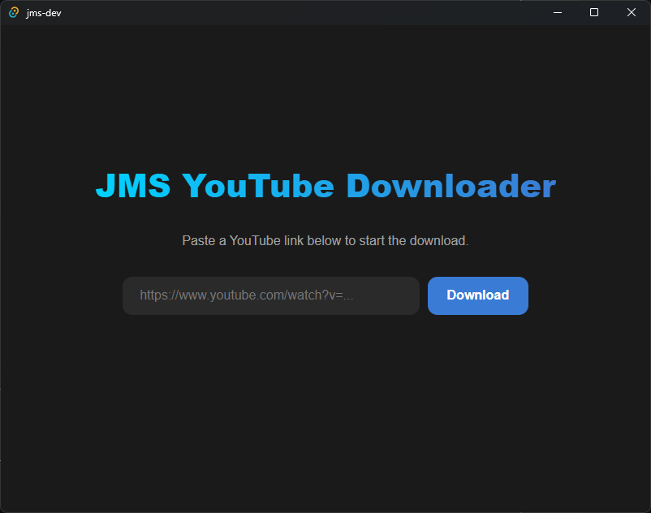

# 📥 JMS Universal Video Downloader

A fast, lightweight, and modern desktop application for downloading videos from YouTube, Facebook, TikTok, and more. Built with **Tauri 2.0**, **Rust**, and **Vanilla JavaScript** for maximum performance and a tiny footprint.



## ✨ Features
- **Modern UI**: Clean, dark-themed interface with zero-clutter.
- **Universal Support**: Uses `yt-dlp` under the hood, allowing downloads from over 1,000 sites including YouTube, Facebook, Instagram, and Twitter/X.
- **Custom Location**: Select your preferred download folder via native Windows dialogs.
- **Asynchronous**: Downloads run in the background without freezing the UI.
- **Ultra Lightweight**: Built with Rust, keeping resource usage to a minimum.

## 🛠️ Tech Stack
- **Frontend**: HTML5, CSS3, JavaScript (Vanilla)
- **Backend**: Rust (Tauri 2.0 Framework)
- **Dependencies**: `tauri-plugin-shell`, `tauri-plugin-dialog`, `yt-dlp` (as a sidecar)

## 🚀 Getting Started

### Prerequisites
- [Rust & Cargo](https://www.rust-lang.org/tools/install)
- [Node.js & npm](https://nodejs.org/)
- `yt-dlp` sidecar binary placed in `src-tauri/binaries/`

### Installation & Development
1. Clone the repository:
   ```bash
   git clone [https://github.com/JMS-tesoy/JMS-YTDL.git](https://github.com/JMS-tesoy/JMS-YTDL.git)
   cd JMS-YTDL


   Install dependencies:
                npm install
   
   Add the necessary plugins (if not already present):
                Bash
                npm run tauri add shell
                npm run tauri add dialog

Run the application in development mode:
                npm run tauri dev

Building for Production
To bundle the application into a standalone .exe:
                npm run tauri build


                
